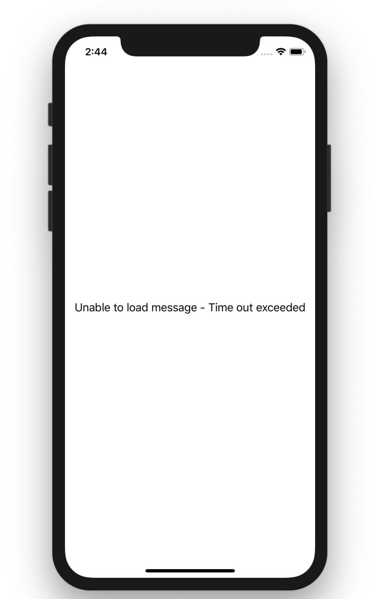

# ConcurrencyTest
This application fetches message in two parts asynchronously joint them sequentially. If either part of message takes more than 2 second it shows `Unable to load message - Time out exceeded`.

## Screenshots

## LoadMessage UnitTests

